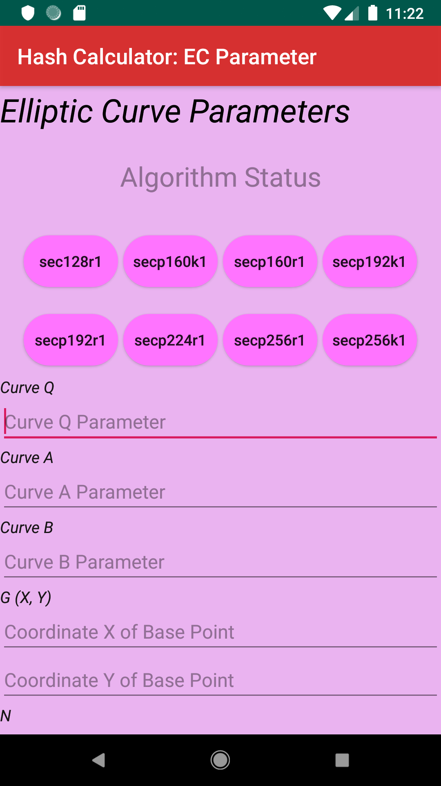

**HASH CALCULATOR**

To generate the calculated hash on given inputs

```APK is updated in the apk folder ```
   
  ``` Just click raw to download```
  
 * __Signature verification to authenticate by using Punlic Key__<br>
  ```           ```
 * __Algorithm used SHA256withECDSA__
 
 * __ECDSA Key Exchange part added (Working Currently on it)__
 
 `Note` : By Clicking "Elliptic Curve Parameters" on EC Exchange, The current Page will transit to "Elliptic Curve Parameters" .
 ------
 
 
 Snapshot of the application:
 ----------------------------
 
   
 
 
 `Note`
 ------

* ECDSA Key Exchanger can be opened from the hash generator page from the right top corner of the menu, will be appeared as a dropped down list.
* Only Random Value generator is available on it. Currently working on Key Exchanger Field and will be updated shortly.

``* EC Exchange is on progress and will be completed sortly.``

* App will crash for below android version 24. [This will be fixed in next update.] 
